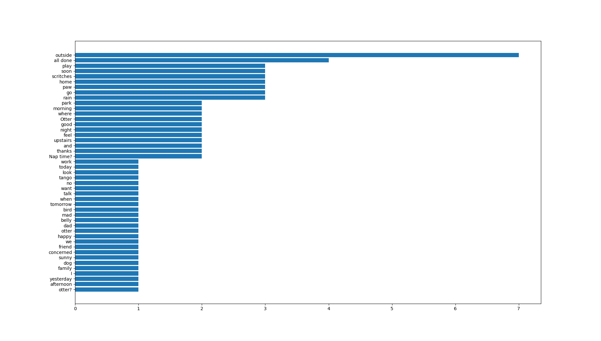
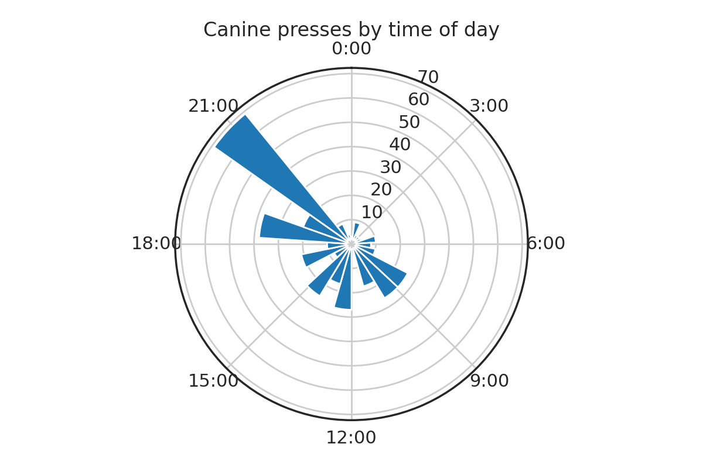
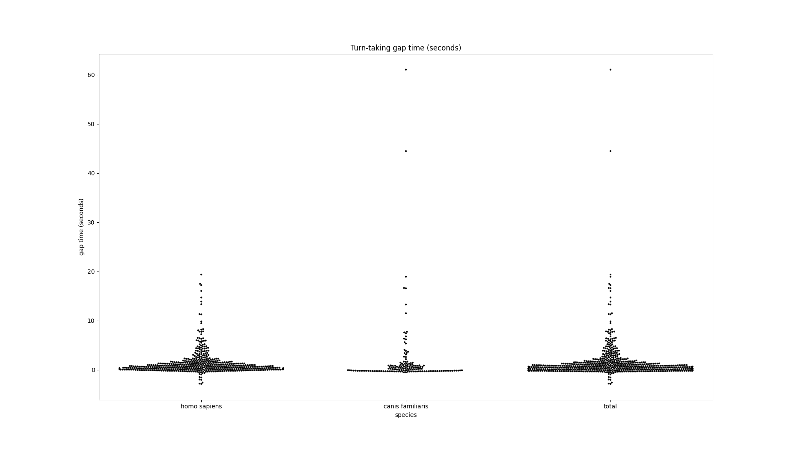

# Cleverpet Eventstream Documentation

As technology is increasingly used to observe and interact with animals, we are excited about the insights researchers and hobbyists might gain through analyzing such data.

This document outlines a json format for storing evenstreams of interspecies AAC device interactions and provides some example data analyses using data stored in this manner.

## Desiderata

We designed this format with the following desiderata

1. **extensible** this format ought to capture behaviors from multiple species and interactional contexts
1. **human readable** researchers, hobbyists, and data producers ought to be able to understand and inspect the data
1. **easy to analyze** the format ought to be easy to analyze

We achieve extensibility by using a sequence of `Event`s as our primary data structure. An `Event` is defined only as a type of occurrance at a point in time. It may be extended to incorporate extra data, e.g., parsed tokens of a human vocalization or behaviors in an ethogram.

When possible we use human readable ids and timestamps.

While tabular data is easier to analyze than nested `json` data due to the ubiquity of speadsheet and dataframe tools, our data format can be transformed into a tabular format for analysis *but* without sacrificying extensibility.


## Evenstream Format

The core data file is a json eventstream.

```json
{
    "id": string, # id of file
    "provenance": string, # id of data producer
    "start": timestamp, # start of stream
    "end": timestamp, # end of stream
    "agents": [<Agent>],
    "events": [<Event>]
}
```
A `provenance` is a data producer, e.g., a company like Cleverpet would have a provenance id like `"cleverpet"`.

Each eventstream file has a provenance scoped `id` like `cleverpet.100`.

Each evenstream file has a `start` and `end`. All timestamps in these files should be `ISO 8601` formatted.

Each eventstream may have a list of agents, who may generate events.

### Agent

An agent object contains the following

```json
{
    "id": string, # provenance scoped id
    "species": string # species name
}
```

An agent has a provenance scoped `id` like the following `"cleverpet.dog.100"` which includes a short-form name for readability. This prevents collisions between two data producers; it also affords some human readability.

`Species` is species name of the agent in binomial nomenclature, e.g., `"canis familiaris"`.

### Event

Events are extendable objects which may represent agent actions.

```json
{
    "id": string, # file scoped id
    "type": string, # event type
    "agent": string, # (optional) agent id
    "start": timestamp, # start of event
    "end": timestamp, # (optional)
    "content": string, # event content
    "other_data": object, # (optional) extendable object
}
```

Events are designed flexibly represent events in time. These may be actions caused by an agent or they may be agentless occurrences. Events may span time or may be moments in time.

As is relevant to Cleverpet, button presses can be easily represented in this structure: agents cause a `button_press` type event and the button label is stored in `content`. Human utterances may also be represented. Here we would use a `vocalization` type and store the transcript in `content`. Inside `other_data`, one could store the tokenized output of the uttereance after it has passed through an NLP pipeline, e.g.,

```json
        {
            "id": "cleverpet.0.2",
            "type": "utterance",
            "agent": "cleverpet.human.0",
            "start": "2021-10-11T05:52:40.0123000",
            "end": "2021-10-11T05:52:42.0123000",
            "content": "no outside",
            "other_data": {
                "content_tokens": [
                    {
                        "token": "no",
                        "start": "2021-10-11T05:52:40.0123000",
                        "end": "2021-10-11T05:52:41.0123000"
                    },
                    {
                        "token": "outside",
                        "start": "2021-10-11T05:52:41.0123000",
                        "end": "2021-10-11T05:52:42.0123000"
                    }
                ]
            }
```

One could imagine representing behaviors defined in an ethogram in such a schema, perhaps disambiguating between 'overloaded' ethograms using scoped `type`s, e.g., `cleverpet.evenson_ethogram.lip_licking`.

### Example

```json
{
    "id": "cleverpet.75",
    "provenance": "cleverpet",
    "start": "2021-11-21T18:30:35.911000",
    "end": "2021-11-21T18:31:35.961000",
    "agents": [
        {
            "id": "cleverpet.dog.75",
            "species": "canis familiaris"
        },
        {
            "id": "cleverpet.human.75",
            "species": "homo sapiens"
        }
    ],
    "events": [
        {
            "id": "cleverpet.0.0",
            "type": "button_press",
            "agent": "cleverpet.dog.75",
            "start": "2021-11-21T18:30:58.844333",
            "end": "2021-11-21T18:30:59.344333",
            "content": "I"
        },
        {
            "id": "cleverpet.0.1",
            "type": "button_press",
            "agent": "cleverpet.dog.75",
            "start": "2021-11-21T18:30:59.377667",
            "end": "2021-11-21T18:30:59.877667",
            "content": "family"
        },
        {
            "id": "cleverpet.0.2",
            "type": "button_press",
            "agent": "cleverpet.dog.75",
            "start": "2021-11-21T18:31:01.577667",
            "end": "2021-11-21T18:31:02.077667",
            "content": "feel"
        },
        {
            "id": "cleverpet.0.3",
            "type": "button_press",
            "agent": "cleverpet.dog.75",
            "start": "2021-11-21T18:31:02.777667",
            "end": "2021-11-21T18:31:03.277667",
            "content": "morning"
        },
        {
            "id": "cleverpet.0.4",
            "type": "button_press",
            "agent": "cleverpet.dog.75",
            "start": "2021-11-21T18:31:03.244333",
            "end": "2021-11-21T18:31:03.744333",
            "content": "night"
        }
    ]
}
```

## Analysis

First let us look at the most popular buttons:



Unsurprisingly, most of these buttons are the kinds used to make requests.


Second let us look at the hours in which button presses tend to occur:



Third, let us take a look at the gaps between turns in AAC interactions. This kind of analysis is interesting as it allows us to assess whether interactions between canines and humans display any of the regulatory structures found in human-human conversation.



### Converting to tabular data

As alluded to above, it is easy to convert this data format to a tabular format.

```python
import pandas as pd

def tabulate(event_stream):
    rows = []
    file_id = event_stream["id"]
    provenance = event_stream["provenance"]
    start = event_stream["start"]
    end = event_stream["end"]
    agent2species = {
        agent["id"]: agent["species"]
        for agent in event_stream["agents"]
    }
    for event in event_stream["events"]:
        rows.append({
            "file_id": file_id,
            "provenance": provenance,
            "file_start": start,
            "file_end": end,
            "event_id": event["id"],
            "agent": event["agent"],
            "event_type": event["type"],
            "start": event["start"],
            "end": event["end"],
            "species": agent2species[event["agent"]],
            "content": event["content"]
        })
    pd.DataFrame(rows).to_csv("example.csv")
```
