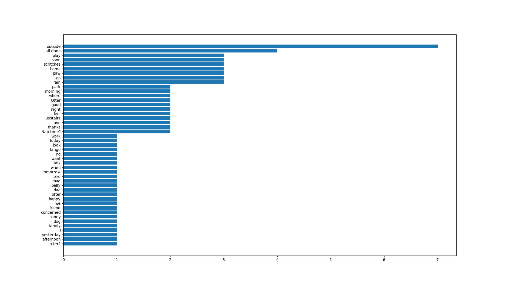
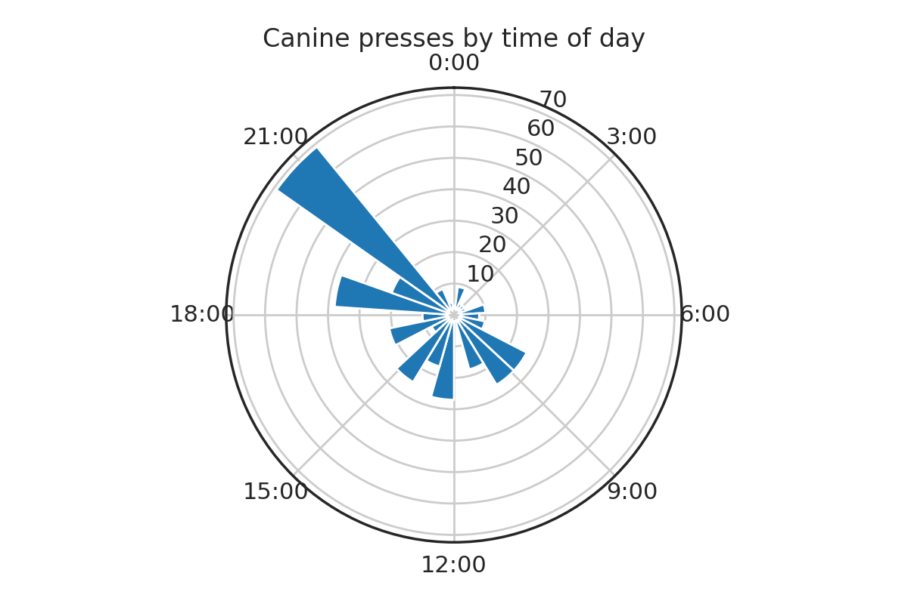
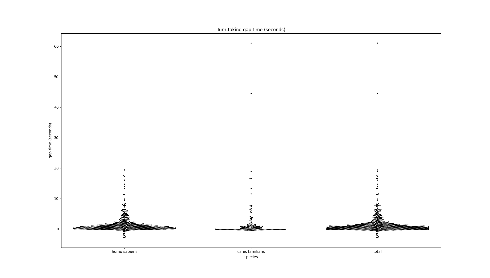

# FluentPet Eventstream Documentation

As technology is increasingly used to observe and interact with animals, we are excited about the insights researchers and hobbyists might gain through analyzing such data.

This document outlines a json format for storing event streams of interspecies AIC device interactions and provides some example data analyses using data stored in this manner.

## Desiderata

We designed this format with the following desiderata

1. **extensible**: this format ought to capture behaviors from multiple species and interactional contexts
1. **human readable**: researchers, hobbyists, and data producers ought to be able to understand and inspect the data
1. **easy to analyze**: the format ought to minimize processing required for data analysis

We achieve extensibility by using a sequence of `Event`s as our primary data structure. An `Event` is defined only as a type of occurrence at a point in time. It may be extended to incorporate extra data, e.g., parsed tokens of a human vocalization or behaviors in an ethogram.

When possible we use human readable ids and timestamps.

While tabular data is easier to analyze than nested `json` data due to the ubiquity of spreadsheet and dataframe tools, our data format can be transformed into a tabular format for analysis *but* without sacrificing extensibility.


## Eventstream Format

The core data file is a json eventstream.

```json
{
    "schema_version": "1.0.0",
    "id": string, # id of file
    "provenance": string, # id of data producer
    "start": timestamp, # start of stream
    "end": timestamp, # end of stream
    "agents": [<Agent>],
    "events": [<Event>]
}
```
A `provenance` is a data producer, e.g., a company like CleverPet/FluentPet would have a provenance id like `"cleverpet"`.

Each eventstream file has a provenance-scoped `id` like `cleverpet.100`.

Each eventstream file has a `start` and `end`. All timestamps in these files should be `ISO 8601` formatted.

Each eventstream may have a list of agents, who may generate events.

### Agent

An agent object contains the following

```json
{
    "id": string, # provenance-scoped id
    "species": string # species name
}
```

An agent has a provenance-scoped `id` like the following `"cleverpet.dog.100"` which includes a short-form name for readability. This prevents collisions between two data producers; it also affords some human readability.

`Species` is the species name of the agent in binomial nomenclature, e.g., `"canis familiaris"`.

### Event

Events are extendable objects which may represent agent actions.

```json
{
    "id": string, # file scoped id
    "type": string, # event type
    "agent": string, # (optional) agent id who produced the event
    "present": [string | object], # (optional) agents present — see below
    "start": timestamp, # start of event
    "end": timestamp, # (optional)
    "content": string, # event content
    "other_data": object, # (optional) extendable object
}
```

Events are designed to flexibly represent events in time. These may be actions caused by an agent or they may be agentless occurrences. Events may span time or may be moments in time.

As is relevant to CleverPet, button presses can be easily represented in this structure: agents cause a `button_press` type event and the button label is stored in `content`. Human utterances may also be represented. Here we would use a `vocalization` type and store the transcript in `content`. Inside `other_data`, one could store the tokenized output of the utterance after it has passed through an NLP pipeline, e.g.,

```json
        {
            "id": "cleverpet.0.2",
            "type": "utterance",
            "agent": "cleverpet.human.0",
            "start": "2021-10-11T05:52:40.0123000",
            "end": "2021-10-11T05:52:42.0123000",
            "content": "no outside",
            "other_data": {
                "content_tokens": [
                    {
                        "token": "no",
                        "start": "2021-10-11T05:52:40.0123000",
                        "end": "2021-10-11T05:52:41.0123000"
                    },
                    {
                        "token": "outside",
                        "start": "2021-10-11T05:52:41.0123000",
                        "end": "2021-10-11T05:52:42.0123000"
                    }
                ]
            }
```

One could imagine representing behaviors defined in an ethogram in such a schema, perhaps disambiguating between 'overloaded' ethograms using scoped `type`s, e.g., `cleverpet.evenson_ethogram.lip_licking`.

#### Co-presence

The `present` field records which agents were there when an event occurred.

```json
"present": ["dog.75", "human.75"]
```

If omitted, assume all agents in the eventstream. Items can be strings or objects:

```json
"present": [
    "dog.75",
    {"agent": "human.75", "attention": "elsewhere", "distance_m": 3}
]
```

### Example

```json
{
    "schema_version": "1.0.0",
    "id": "cleverpet.75",
    "provenance": "cleverpet",
    "start": "2021-11-21T18:30:35.911000",
    "end": "2021-11-21T18:31:35.961000",
    "agents": [
        {
            "id": "cleverpet.dog.75",
            "species": "canis familiaris"
        },
        {
            "id": "cleverpet.human.75",
            "species": "homo sapiens"
        }
    ],
    "events": [
        {
            "id": "cleverpet.0.0",
            "type": "button_press",
            "agent": "cleverpet.dog.75",
            "start": "2021-11-21T18:30:58.844333",
            "end": "2021-11-21T18:30:59.344333",
            "content": "I"
        },
        {
            "id": "cleverpet.0.1",
            "type": "button_press",
            "agent": "cleverpet.dog.75",
            "start": "2021-11-21T18:30:59.377667",
            "end": "2021-11-21T18:30:59.877667",
            "content": "family"
        },
        {
            "id": "cleverpet.0.2",
            "type": "button_press",
            "agent": "cleverpet.dog.75",
            "start": "2021-11-21T18:31:01.577667",
            "end": "2021-11-21T18:31:02.077667",
            "content": "feel"
        },
        {
            "id": "cleverpet.0.3",
            "type": "button_press",
            "agent": "cleverpet.dog.75",
            "start": "2021-11-21T18:31:02.777667",
            "end": "2021-11-21T18:31:03.277667",
            "content": "morning"
        },
        {
            "id": "cleverpet.0.4",
            "type": "button_press",
            "agent": "cleverpet.dog.75",
            "start": "2021-11-21T18:31:03.244333",
            "end": "2021-11-21T18:31:03.744333",
            "content": "night"
        }
    ]
}
```

## Measurements

Version 1.2.0 introduces **measurements** as a modality-agnostic way to attach numeric data to events. Rather than hard-coding fields for a single modality (e.g., acoustic frequencies), the `measurements` array lets any event carry structured numeric observations — from bioacoustic spectral features, to waggle dance angles, to ethogram motion metrics.

### Core Fields

Events may include the following optional top-level fields:

- **`measurements`**: Array of `{dimension, value, unit?, method?, note?}` objects. Each measurement names what is being measured (`dimension`), gives a numeric `value`, and optionally records the `unit`, `method` of measurement, and a free-text `note`. The dimension vocabulary is open-ended — communities define their own (see [EXTENSIONS.md](EXTENSIONS.md)).
- **`source`**: Links the event to raw sensor data (type, sensor, channel, sample_rate_hz, fps, file, offset_samples, offset_ms, format).
- **`spatial`**: Position and trajectory data (reference_frame, coordinates, unit, trajectory).
- **`classification`**: Automated or manual classification results (method, label, confidence, model version, taxonomy reference).
- **`duration_ms`**: Duration in milliseconds with sub-millisecond precision for fast signals like bat echolocation clicks.
- **`parent_id`**: Links events hierarchically (e.g., a whale song contains themes; a waggle dance contains waggle runs).

Agents may also include a **`communication_profile`** describing their hearing range, vocalization range, primary modalities, and a free-text description.

### Example: Bioacoustics (dolphin signature whistle)

```json
{
    "id": "sarasota.ev.1",
    "type": "vocalization",
    "agent": "sarasota.dolphin.FB185",
    "start": "2024-07-15T09:23:14.337000",
    "duration_ms": 684,
    "content": "signature_whistle",
    "measurements": [
        { "dimension": "freq_min_hz", "value": 5200, "unit": "Hz", "method": "spectrogram" },
        { "dimension": "freq_max_hz", "value": 14800, "unit": "Hz", "method": "spectrogram" },
        { "dimension": "dominant_freq_hz", "value": 8900, "unit": "Hz", "method": "spectrogram" },
        { "dimension": "bandwidth_hz", "value": 9600, "unit": "Hz" }
    ],
    "source": {
        "type": "audio",
        "sensor": "hydrophone",
        "channel": 0,
        "sample_rate_hz": 96000,
        "file": "sarasota_2024-07-15_bay.wav",
        "offset_samples": 18524160,
        "format": "wav"
    },
    "classification": {
        "method": "template_matching",
        "label": "FB185_signature",
        "confidence": 0.92,
        "taxonomy": "sarasota_whistle_catalog_2024"
    }
}
```

### Example: Spatial behavior (bee waggle dance)

```json
{
    "id": "sussex.ev.0",
    "type": "waggle_dance",
    "agent": "sussex.bee.W42",
    "start": "2024-08-03T11:02:14.000000",
    "duration_ms": 8500,
    "content": "waggle_dance",
    "measurements": [
        { "dimension": "waggle_angle_deg", "value": 43.2, "unit": "deg", "method": "video_tracking" },
        { "dimension": "waggle_duration_ms", "value": 820, "unit": "ms" },
        { "dimension": "indicated_distance_m", "value": 1250, "unit": "m", "method": "regression_model" }
    ],
    "source": {
        "type": "video",
        "sensor": "overhead_camera",
        "fps": 60,
        "file": "sussex_hive3_2024-08-03.mp4",
        "offset_ms": 134000,
        "format": "mp4"
    },
    "spatial": {
        "reference_frame": "hive_entrance",
        "coordinates": [12.4, 8.1],
        "unit": "cm"
    }
}
```

### Example: Ethogram + button press (dog behavior observation)

```json
{
    "id": "cleverpet.ev.5",
    "type": "ethogram.tail_wag",
    "agent": "cleverpet.dog.200",
    "start": "2024-09-10T14:01:15.000000",
    "duration_ms": 7000,
    "content": "tail_wag_high",
    "measurements": [
        { "dimension": "tail_wag_freq_hz", "value": 5.2, "unit": "Hz", "method": "video_tracking" },
        { "dimension": "tail_height_deg", "value": 65, "unit": "deg", "method": "video_tracking" }
    ],
    "classification": {
        "method": "manual",
        "label": "tail_wag_excited",
        "confidence": 0.95,
        "taxonomy": "hecht_canine_ethogram_2023"
    }
}
```

## Geographic Location

Version 1.3.0 adds a two-level **location** model for recording where data was collected.

- **Eventstream-level `location`**: Describes the study site — set once for the whole file. Use this for fixed-position studies (e.g., a research apiary, a home, a field station).
- **Event-level `location`**: Optional per-event override for mobile data collection where the recording position changes (e.g., a boat-based hydrophone survey, a drone transect).

Both levels use the same `Location` object. The only required field is `coordinates`, which follows **GeoJSON order: `[longitude, latitude]`** or `[longitude, latitude, elevation]`. The default geodetic datum is **WGS84**.

### Location Fields

| Field | Type | Required | Description |
|-------|------|----------|-------------|
| `coordinates` | `[number, ...]` | yes | `[lon, lat]` or `[lon, lat, elevation]` (GeoJSON order) |
| `datum` | string | no | Geodetic datum (default `WGS84`) |
| `elevation_m` | number | no | Elevation in meters (negative for underwater) |
| `site_name` | string | no | Human-readable site name |
| `habitat` | string | no | Habitat type (e.g., pelagic, forest, agricultural, urban) |
| `country` | string | no | ISO 3166-1 country code or name |
| `region` | string | no | Sub-national region or state |

The `Location` object allows additional properties, so domain-specific fields can be added freely. Habitat vocabularies can be standardized via community extensions — see [EXTENSIONS.md](EXTENSIONS.md).

### Example

```json
{
    "schema_version": "1.3.0",
    "id": "survey.transect.1",
    "provenance": "marine_lab",
    "start": "2024-07-15T09:20:00.000000",
    "end": "2024-07-15T09:35:00.000000",
    "location": {
        "coordinates": [-156.83, 20.78],
        "elevation_m": -50,
        "site_name": "Auau Channel, Maui",
        "habitat": "pelagic",
        "country": "US",
        "region": "Hawaii"
    },
    "agents": [],
    "events": [
        {
            "id": "ev.1",
            "type": "vocalization",
            "start": "2024-07-15T09:23:14.337000",
            "content": "signature_whistle",
            "location": {
                "coordinates": [-156.831, 20.781],
                "elevation_m": -8
            }
        }
    ]
}
```

## Analysis

First, let us look at the most popular buttons:



Unsurprisingly, most of these buttons are the kinds used to make requests.


Second, let us look at the hours in which button presses tend to occur:



Third, let us take a look at the gaps between turns in AIC interactions. This kind of analysis is interesting as it allows us to assess whether interactions between canines and humans display any of the regulatory structures found in human-human conversation.



### Converting to tabular data

As alluded to above, it is easy to convert this data format to a tabular format.

```python
import pandas as pd

def tabulate(event_stream):
    rows = []
    file_id = event_stream["id"]
    provenance = event_stream["provenance"]
    start = event_stream["start"]
    end = event_stream["end"]
    agent2species = {
        agent["id"]: agent["species"]
        for agent in event_stream["agents"]
    }
    for event in event_stream["events"]:
        rows.append({
            "file_id": file_id,
            "provenance": provenance,
            "file_start": start,
            "file_end": end,
            "event_id": event["id"],
            "agent": event["agent"],
            "event_type": event["type"],
            "start": event["start"],
            "end": event["end"],
            "species": agent2species[event["agent"]],
            "content": event["content"]
        })
    pd.DataFrame(rows).to_csv("example.csv")
```

## Versioning

Every eventstream file includes a `schema_version` field indicating which version of the schema it conforms to. The project follows Semantic Versioning: patch releases for documentation changes, minor releases for additive fields, and major releases for breaking changes. Implementations must follow a "must-ignore and preserve" policy for unknown fields.

For the full versioning policy, compatibility guarantees, and migration guide template, see [VERSIONING.md](VERSIONING.md).

## Extensions

The eventstream schema uses a minimal universal core plus domain-specific extensions architecture, inspired by Darwin Core. New event types, agent properties, and context fields can be proposed without modifying the core schema. Extensions use dot-scoped namespaces (e.g., `ucdavis.ethogram.lip_licking`) to avoid collisions.

For the extension registry, example extensions, and the proposal template, see [EXTENSIONS.md](EXTENSIONS.md).

## Validation

A validation script is provided to check eventstream JSON files against the schema:

```
python validate.py data_sample/cleverpet.1.json
```

The script reports any schema violations and confirms whether a file is valid.
